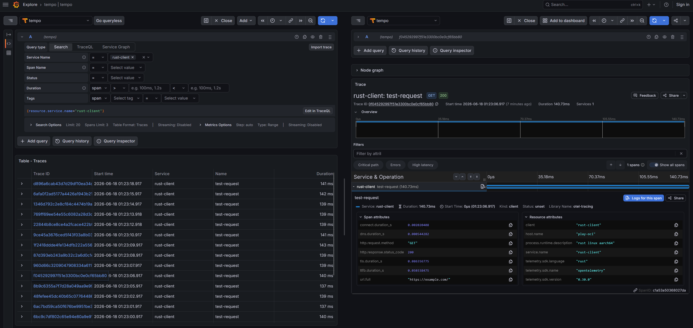
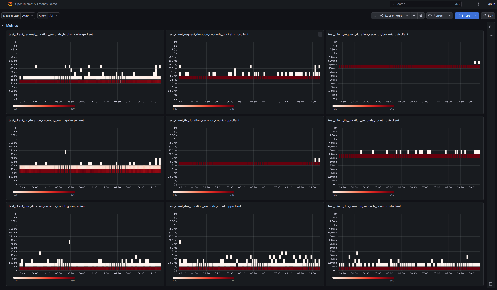

# OpenTelemetry Latency Demo

A multi-language proof of concept (PoC) demonstrating how to measure, compare, and observe network latency and HTTP client performance over time using **OpenTelemetry (OTel)**.

---

## Examples & Analysis

### Trace Example

*Analysis:* Granular per-request timing spans allow you to profile latency at the network layer. In the trace above, comparing the network phases (DNS, TCP, and TLS) helps pinpoint bottlenecks. For instance, the timing waterfall indicates potential optimization areas in the Rust client's TLS handshake performance.

### Aggregated Metrics Dashboard

*Analysis:* The dashboard aggregates the client histograms to show latency trends over time. The metrics indicate that under these test conditions, the Go client achieves the lowest overall request latency.

---

## The Problem
When HTTP clients implemented in different languages (Go, C++, and Rust) connect to a target host over HTTPS and transmit data, it can be challenging to compare their performance profiles. To debug performance issues, we need a unified way to observe, measure, and analyze their latencies and network phase timings (DNS lookup, TCP handshake, TLS negotiation, and Time-to-First-Byte) under the same conditions over time.

## Solution / Proof of Concept
This project provides three minimal, OTel-instrumented HTTP clients built in:
*   **Go** (in [golang/](file:///home/jan/git/latency-demo/golang))
*   **C++** (in [cpp/](file:///home/jan/git/latency-demo/cpp))
*   **Rust** (in [rust/](file:///home/jan/git/latency-demo/rust))

Each client continuously issues HTTP GET requests to a target host at a configurable interval and generates three core OpenTelemetry signals:

*   **Metrics**: Measures request latency and network phases, exporting them as histograms (with custom explicit bucket boundaries optimized for sub-second requests) so that operations teams can visualize latency percentiles over time.
*   **Traces**: Generates a detailed span (`test-request`) for each request, injecting W3C trace context headers and attaching detailed timing attributes (e.g., DNS resolution, TCP handshake, TLS connection, HTTP method, status codes, and payload sizes). This enables deep-dive waterfall analysis for individual requests.
*   **Logs**: Emits structured, contextual logging to capture additional runtime information, correlated with the corresponding trace/span IDs.

All generated telemetry signals are exported via the **OpenTelemetry Protocol (OTLP)** to a collector, which forwards them to the appropriate storage backend.

---

## Quick Start

The project includes a root 'Makefile' to build and run all three clients in Docker seamlessly.

### 1. Build Client Docker Images
Build the Docker images for all three language agents (Go, C++, and Rust):
```bash
make
```
*(Or target a specific agent, e.g., `make rust`, `make golang`, or `make cpp`)*

### 2. Run All Agents in the Background
Start all three agents concurrently in detached mode:
```bash
make run
```
By default, this configures the containers to use `--network host` so they can easily communicate with an OTel Collector running on your local machine.

### 3. View Agent Logs
To follow the logs for a specific agent:
```bash
docker logs -f otel-http-client-golang
docker logs -f otel-http-client-cpp
docker logs -f otel-http-client-rust
```

### 4. Stop All Agents
Stop and clean up all running agent containers:
```bash
make stop
```

---

## Configuration

Clients can be configured using standard OpenTelemetry environment variables and custom application variables:

| Environment Variable | Default | Description |
| :--- | :--- | :--- |
| `TEST_URL` | `https://example.com/` | The target URL to probe. |
| `TEST_PERIOD` | `1s` | The interval between requests (e.g., `500ms`, `2s`, `1m`). |
| `OTEL_EXPORTER_OTLP_ENDPOINT` | `http://localhost:4318` | The OTLP endpoint where signals are sent. |

> [!NOTE]
> For detailed configurations, default values, and build instructions specific to each language client, please refer to the respective README files in the `golang`, `cpp`, and `rust` folders.

---

## Storage & Visualization

To store and visualize the generated OTel signals, you can set up an observability stack using Grafana, Prometheus, Tempo, and Loki via their native OTLP ingestion support. 

The following my projects provide reference configurations and guides:
*   **Observability Stack Setup**: Deploy a pre-configured Grafana/OTel telemetry stack using the [grafana-opentelemetry](https://github.com/monitoringartist/grafana-opentelemetry) repository.
*   **Collector Monitoring**: Monitor the health and throughput of your OpenTelemetry Collector instance using [opentelemetry-collector-monitoring](https://github.com/monitoringartist/opentelemetry-collector-monitoring).
*   **Production Security Challenges**: When deploying to production, ensure you guard against pipeline issues such as telemetry poisoning. See [OpenTelemetry Trace Pipeline Poisoning](https://github.com/monitoringartist/opentelemetry-trace-pipeline-poisoning) for security practices and mitigations.

## About the Author

This project is published by **Jan Garaj** – a Senior Observability, SRE, and DevOps Engineer, and an official **Grafana Champion** (since 2023). Jan has over a decade of experience designing, automating, and scaling production-grade telemetry pipelines and cloud-native infrastructure for global enterprises.

### Key Highlights & Impact
*   **Community Impact**: Author of popular open-source projects under **Monitoring Artist**, achieving **5,000+ GitHub stars**, **72,000,000+ public Docker image downloads**, and **60,000,000+ Grafana AWS dashboard downloads**.
*   **Enterprise Experience**: Designed and implemented multi-tenant observability infrastructure across 40+ Kubernetes clusters, unified ingestion pipelines (Mimir, Loki, Tempo, OTel Collectors), and automated telemetry management for industry leaders including **KKR & Co. Inc.**, **Volkswagen**, **BBC**, and **StepStone**.
*   **Specialist Expertise**: Deep knowledge of OpenTelemetry standards, eBPF-based auto-instrumentation, high-performance monitoring modules, and automation with Terraform, CloudFormation, Go, and Python.

### Hire Jan for Your Next Project
Looking for a Senior Observability, SRE, or DevOps Consultant/Contractor to design robust telemetry pipelines, secure your OTel workflows, scale Kubernetes infrastructure, or optimize monitoring costs?

*   **Website**: [www.jangaraj.com](https://www.jangaraj.com)
*   **LinkedIn**: [linkedin.com/in/jangaraj](https://www.linkedin.com/in/jangaraj)
*   **GitHub**: [monitoringartist](https://github.com/monitoringartist)
*   **Email**: [jan.garaj@gmail.com](mailto:jan.garaj@gmail.com)
*   **Phone / WhatsApp**: +44 79 234 69004 (UK)
